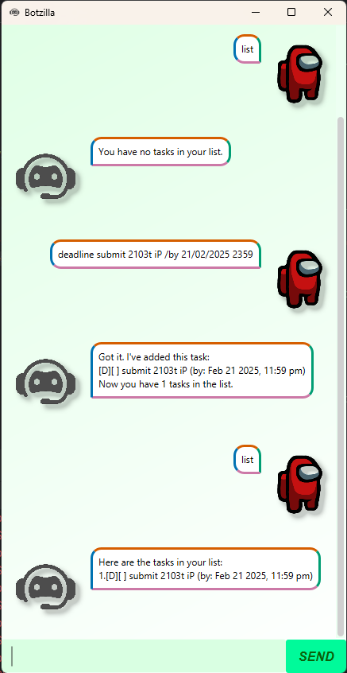

# Botzilla User Guide



## Introduction
Botzilla is a **simple and lightweight** chatbot that helps you manage your tasks. It supports commands such as:
- `todo` - Add a todo task
- `deadline` - Add a deadline task
- `event` - Add an event task
- `list` - List all tasks
- 'mark' and 'unmark' - Mark or unmark a task as done
- `delete` - Delete a task
- `find` - Find tasks by keyword
- 'sort' - Sort tasks by date in ascending order

> [!NOTE]
> 
> - The chatbot is case-insensitive, so you can type commands in any case.

---

## Quick Start

### System Requirements
- Please ensure you have installed **Java 17** on your computer.
- Download the latest version of Botzilla jar file from GitHub releases.

### Running Botzilla
1. Open a terminal window (windows) or command prompt (macOS).
2. Navigate to the directory where the Botzilla jar file is located.
3. Run the following command to start the chatbot:
    ```bash
    java -jar BotzillaV2.jar
    ```

Botzilla should start running and display a welcome message through the GUI.   

---

## Features (Commands)

### 1. Adding a task - `todo`, `deadline`, `event`
Creates a new task (todo, deadline, event):
- **Todo**: A task without any date/time attached to it.
- **Deadline**: A task that needs to be done before a specific date/time.
- **Event**: A task that starts at a specific time and ends at a specific time.

#### Format:
```bash
todo <DESCRIPTION>
deadline <DESCRIPTION> /by <dd/MM/yyyy HHmm>
event <DESCRIPTION> /from <dd/MM/yyyy HHmm> /to <dd/MM/yyyy HHmm>
```
#### Example:
```bash
todo Read book
deadline Submit 2103t assignment /by 21/02/2025 2359
event Project meeting /from 21/02/2025 1400 /to 21/02/2025 1600
```

### 2. Listing all tasks - `list`
Shows a list of all tasks.
#### Format:
```bash
list
```

### 3. Marking a task as done - `mark`
Marks a task as done.
#### Format:
```bash
mark <TASK_INDEX>
```
#### Example:
```bash
mark 1
```

### 4. Unmarking a task as not done - `unmark`
Unmarks a task as not done.
#### Format:
```bash
unmark <TASK_INDEX>
```
#### Example:
```bash
unmark 1
```

### 5. Deleting a task - `delete`
Deletes a specified task index from the list.
#### Format:
```bash
delete <TASK_INDEX>
```
#### Example:
```bash
delete 1
```

### 6. Finding tasks by keyword - `find`
Finds tasks that contain the keyword specified by user.
#### Format:
```bash
find <KEYWORD>
```
#### Example:
```bash
find book
```

### 7. Sorting tasks by date - `sort`
Sorts tasks by date in ascending order, only applicable for deadline and event tasks.
#### Format:
```bash
sort
```

### 8. Exiting Botzilla - `bye`
Exits the Botzilla application.
#### Format:
```bash
bye
```

> [!IMPORTANT NOTE]
> 
> - The task index refers to the index number shown in the displayed task list.
> - The task index must be a positive integer 1, 2, 3, …
> - Task data is saved automatically after each command.

---
Enjoy your time using Botzilla! 🤖